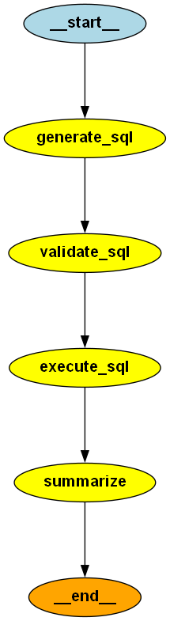

# Retail Data Analyst Agent

LangGraph-powered SQL agent that converts natural language business questions into safe MySQL queries using an LLM, executes validated read-only queries against a retail database, and generates concise, business-friendly insights from the results. The agent incorporates SQL safety validation, conversational memory for follow-up questions, and a modular workflow for reliable and explainable data analysis.

## Features

- Safe SQL validation to block destructive statements
- SQL execution helper for SELECT queries
- Simple memory/history support for conversation context
- LangGraph-based workflow scaffolding for agent-style execution
- Basic gateway client integration for LLM-based SQL generation

## Project Structure

- `src/` – core application modules
  - `app.py` – main application entry point
  - `safety.py` – SQL validation helpers
  - `sql_tools.py` – SQL execution helpers
  - `memory.py` – memory and conversation history helpers
  - `graph.py` – LangGraph workflow logic
  - `tiger_gateway_client.py` – LLM gateway client
- `tests/` – pytest test suite
- `data/` – sample CSV data
- `database/` – schema and loading scripts

## Setup

1. Create and activate a virtual environment:
   ```bash
   python -m venv .venv
   source .venv/bin/activate
   ```
   On Windows PowerShell:
   ```powershell
   .\.venv\Scripts\Activate.ps1
   ```

2. Install dependencies:
   ```bash
   pip install -r requirements.txt
   ```

3. Set any required environment variables for the LLM gateway, if needed.

## Running the App

Run the interactive app:

```bash
python -m src.app
```

### CLI Example

```text
Question: Which city generated the highest total sales revenue?

Generated SQL
----------------------------------------------
SELECT s.city, SUM(st.units_sold * st.unit_price * (1 - st.discount_pct / 100)) AS total_revenue
FROM sales_transactions st
JOIN stores s ON st.store_id = s.store_id
GROUP BY s.city
ORDER BY total_revenue DESC
LIMIT 1

Answer
----------------------------------------------
The city of Bhopal generated the highest total sales revenue, amounting to approximately 39,794. This indicates that
Bhopal is a key market contributing significantly to overall sales performance.

Rows Returned: 1

Sample Rows
----------------------------------------------
{'city': 'Bhopal', 'total_revenue': Decimal('39793.817500')}
```

## LangGraph Workflow

The application uses a LangGraph-style workflow to structure the agent steps:

1. `generate_sql` – produce a SELECT query from the user question and schema.
2. `validate_sql` – enforce safe SQL rules and reject destructive or multi-statement queries.
3. `execute_sql` – run the validated query against the configured database.
4. `summarize` – turn the result rows into a concise business-friendly answer.

### Workflow Diagram



## Running Tests

Run the test suite with:

```bash
pytest
```
